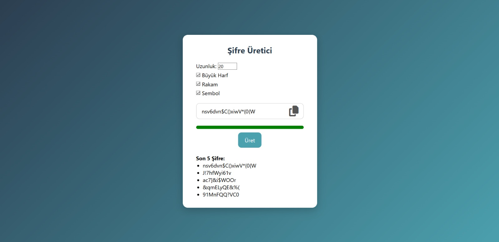

# 🔐 Şifre Üretici (Password Generator)

Bu proje, kullanıcıların güvenli, rastgele ve güçlü şifreler oluşturmasına olanak tanıyan basit bir web uygulamasıdır. HTML, CSS ve JavaScript kullanılarak geliştirilmiştir.

## 🚀 Özellikler

- 🔢 Şifre uzunluğunu ayarlayabilme (6–30 karakter)
- 🔠 Büyük harf, rakam ve sembol seçeneklerini açıp kapatma
- 🟩 Şifre gücünü renkli çubuk ile gösterme (Zayıf / Orta / Güçlü)
- 📋 Oluşturulan şifreyi panoya kopyalama
- 📜 Son 5 oluşturulan şifreyi listeleme

## 🧠 Öğrenilenler

- Rastgele karakter üretimi (`Math.random()`)
- DOM işlemleri ile form ve input yönetimi
- `navigator.clipboard` ile panoya kopyalama işlemi
- Şifre gücünü değerlendirme ve görsel geri bildirim sağlama
- Kullanıcı deneyimini artıracak küçük ama etkili detaylar

🖼️ Ekran Görüntüsü

